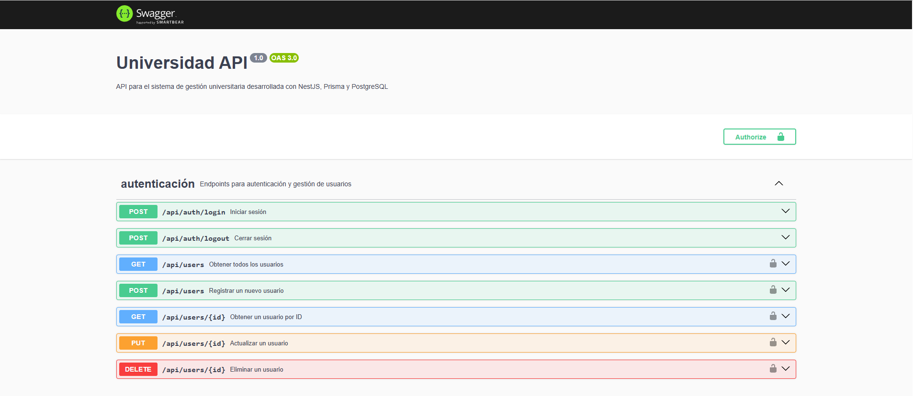

<div align="center">

# 🎓 Universidad API

[](https://nestjs.com/)
[](https://www.postgresql.org/)
[](https://www.prisma.io/)
[](https://jwt.io/)
[](https://swagger.io/)

API RESTful para el sistema de gestión universitaria desarrollada con arquitectura limpia.

[Características](#características) • [Instalación](#instalación) • [Uso](#ejecución) • [Documentación](#documentación-api) • [Licencia](#licencia)

</div>

## 📋 Descripción

Este proyecto implementa una API RESTful para la gestión de una universidad, siguiendo los principios de Clean Architecture. Proporciona un sistema completo para administrar estudiantes, profesores, cursos, calificaciones y más.

## 🛠️ Tecnologías

| Categoría | Tecnologías | Versión |
|-----------|-------------|--------|
| **Backend** |  | v16.x |
| |  | v9.x |
| **Base de datos** |  | v14.x |
| **ORM** |  | v4.x |
| **Autenticación** |  | v9.x |
| **Documentación** |  | v6.x |

## 📁 Estructura del Proyecto

```
src/
├── domain/              # Reglas de negocio y entidades
│   ├── entities/        # Entidades del dominio
│   ├── repositories/    # Interfaces de repositorios
│   └── use-cases/       # Casos de uso
├── infrastructure/      # Implementaciones externas
│   ├── database/        # Configuración de base de datos
│   │   ├── prisma/      # Cliente y esquema de Prisma
│   │   └── repositories/# Implementación de repositorios
│   ├── auth/            # Servicios de autenticación
│   └── services/        # Servicios externos
├── application/         # Lógica de aplicación
│   ├── dto/             # Objetos de transferencia de datos
│   ├── mappers/         # Convertidores entre entidades y DTOs
│   └── validators/      # Validadores
├── interfaces/          # Adaptadores de interfaz
│   ├── controllers/     # Controladores REST
│   └── routes/          # Definición de rutas
└── shared/              # Utilidades compartidas
    ├── guards/          # Guards de autenticación
    ├── interceptors/    # Interceptores
    └── utils/           # Utilidades generales
```

## 🚀 Instalación

<details>
<summary>Prerrequisitos</summary>

- Node.js (v16.x o superior)
- PostgreSQL (v14.x o superior)
- npm (v8.x o superior) o yarn (v1.22.x o superior)

</details>

1. **Clonar el repositorio:**
   ```bash
   git clone https://github.com/dfajardoCNE/university-api.git
   cd university-api
   ```

2. **Instalar dependencias:**
   ```bash
   npm install
   ```

3. **Configurar variables de entorno:**
   ```bash
   cp .env.example .env
   # Editar .env con tus configuraciones
   ```

4. **Generar el cliente de Prisma:**
   ```bash
   npx prisma generate
   ```

5. **Ejecutar migraciones de base de datos:**
   ```bash
   npx prisma migrate dev
   ```

## ▶️ Ejecución

```bash
# Desarrollo
npm run start:dev

# Producción
npm run build
npm run start:prod
```

> 💡 **Tip**: Usa `npm run start:debug` para ejecutar con soporte de depuración.

## 📚 Documentación API

La documentación interactiva de la API está disponible en Swagger:

```
http://localhost:3000/api/docs
```

<div align="center">



</div>

## 🔐 Roles y Permisos

| Rol | Descripción | Permisos |
|-----|-------------|----------|
| **👑 Admin** | Administrador del sistema | Acceso completo a todas las funcionalidades |
| **👨‍🏫 Profesor** | Personal docente | Gestión de cursos, calificaciones y materiales |
| **👨‍🎓 Estudiante** | Alumnos registrados | Consulta de cursos, inscripciones y calificaciones |

## 📄 Licencia

[](https://opensource.org/license/mit)

Este proyecto está bajo la Licencia MIT. Consulta el archivo [LICENSE](LICENSE) para más detalles.

---

<div align="center">

### ¿Encontraste un error o tienes una sugerencia?

[](https://github.com/dfajardoCNE/university-api/issues/new)

</div>